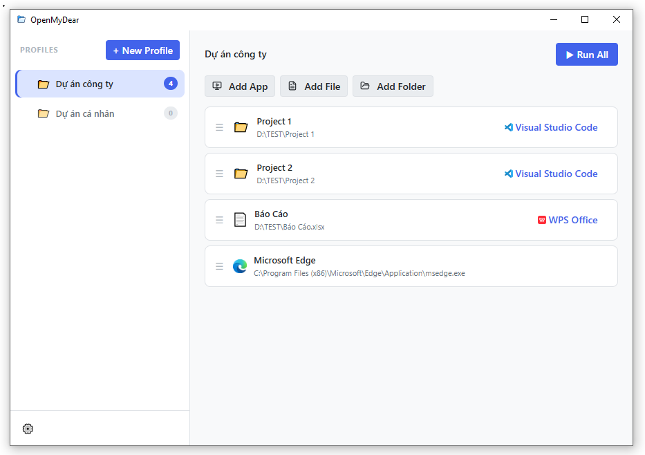

<div align="center">

# OpenMyDear

**One click. Everything opens.**

A lightweight desktop launcher that lets you group apps, files, and folders into profiles — then launch them all at once.

Built with [Tauri v2](https://tauri.app/) + React + Rust.



</div>

---

## Features

- **Launch Profiles** — group apps, files, and folders into named profiles and launch them all at once
- **Custom "Open With"** — optionally specify which app opens each item (e.g. open a folder in VS Code)
- **Platform Filtering** — mark items as Windows-only, macOS-only, or both; non-matching items are skipped automatically
- **Drag & Drop** — reorder profiles and items by dragging
- **Run Results** — see a summary of what launched and what failed after each run
- **Auto-save** — changes are persisted automatically
- **Launch on Startup** — optionally start OpenMyDear when the OS boots
- **Dark / Light Mode** — follows the OS theme
- **Bilingual UI** — English and Vietnamese

## Tech Stack

| Layer | Technology |
| --- | --- |
| Desktop Shell | [Tauri v2](https://tauri.app/) |
| Backend | Rust |
| Frontend | React 19 + TypeScript |
| Bundler | Vite 7 |
| Drag & Drop | @dnd-kit/core + @dnd-kit/sortable |
| Styling | CSS Modules + CSS Custom Properties |
| Icons | lucide-react |

## Prerequisites

- [Node.js](https://nodejs.org/) v18+
- [Rust / Cargo](https://rustup.rs/)
- **Windows only** — MSVC C++ Build Tools (Visual Studio Installer > "Desktop development with C++")

## Getting Started

```bash
# Install dependencies
npm install

# Development (full native window + HMR)
# On Windows, run dev.bat first to set up the MSVC environment
npm run dev:app

# Frontend-only dev server (no native window, port 1420)
npm run dev

# Type check
npx tsc --noEmit

# Production build
npm run build:tauri
```

## Scripts

| Script | Description |
| --- | --- |
| `npm run dev` | Vite dev server only (port 1420, no native window) |
| `npm run dev:app` | Full Tauri dev — compiles Rust + native window with HMR |
| `npm run build` | Type-check + bundle frontend to `dist/` |
| `npm run preview` | Preview production frontend build in browser |
| `npm run build:tauri` | Build the full native app installer |

## Project Structure

```
src/                            # React / TypeScript frontend
  commands/index.ts             #   All Tauri IPC calls
  components/                   #   UI components (CSS Modules)
    common/                     #     Shared: Button, Modal
    Sidebar/                    #     Profile list, DnD reorder, new/delete
    ProfileDetail/              #     Profile editor, Run All, quick-add
    ItemRow/                    #     Single item with drag handle & actions
    AddItemDialog/              #     Edit item modal
    OpenWithPicker/             #     OS app picker with icons & search
    RunResultDialog/            #     Post-run success/failure summary
    Settings/                   #     Autostart + language selector
    EmptyState/                 #     Shown when no profile selected
  context/
    ProfileContext.tsx           #   Global state (useReducer + auto-save)
    profileReducer.ts           #   Pure reducer for CRUD & reorder
  hooks/
    useProfiles.ts              #   Convenience hook for ProfileContext
    usePlatform.ts              #   Current OS platform from Rust
  i18n/                         #   en/vi locales, {key} substitution
  types/index.ts                #   TypeScript types (mirrors Rust models)

src-tauri/src/                  # Rust backend
  commands.rs                   #   Tauri command handlers
  models.rs                     #   Serde data models
  storage.rs                    #   profiles.json read/write
  lib.rs                        #   Tauri builder + plugin registration
```

## Data Storage

Profiles are stored as JSON in the OS app data directory:

| OS | Path |
| --- | --- |
| Windows | `%APPDATA%\com.openmydear.app\profiles.json` |
| macOS | `~/Library/Application Support/com.openmydear.app/profiles.json` |

## Architecture

- **Frontend** owns in-memory state via `useReducer`; **Rust** owns the disk.
- State changes dispatch reducer actions and trigger a debounced auto-save (300 ms) to Rust.
- On startup: Rust reads from disk, React hydrates via `SET_PROFILES`.
- `run_profile` opens all platform-matching items and accumulates errors instead of stopping on the first failure.
- IDs are generated with `nanoid()` on the frontend.
- Installed apps are discovered via the Windows Registry (`App Paths`) or by scanning `/Applications` on macOS. Icons are extracted as base64 PNGs via PowerShell on Windows.

## License

MIT
